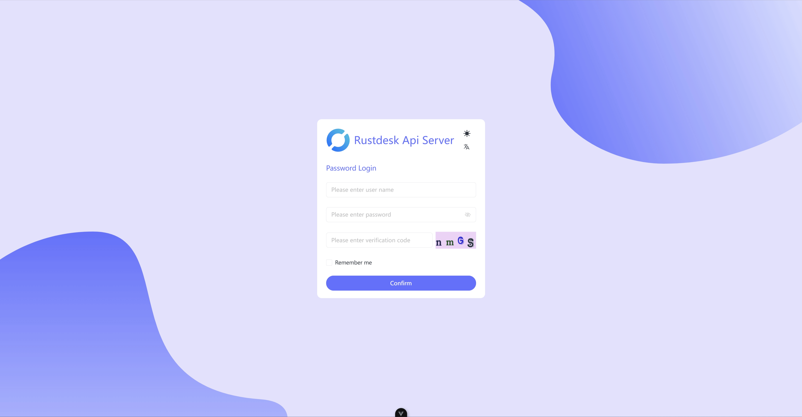
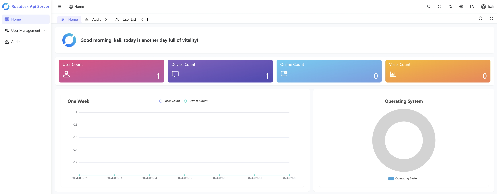
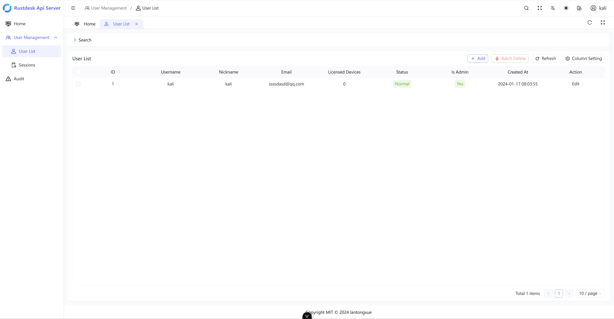
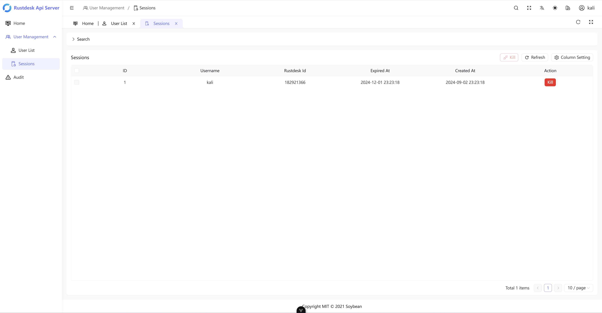
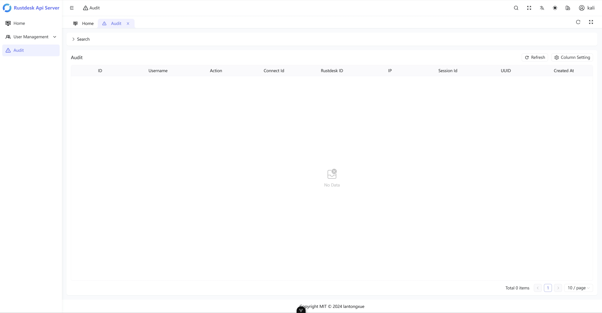

Rustdesk Api Server Pro
============

[English](https://github.com/rustdesk/rustdesk) | [简体中文](https://github.com/lantongxue/rustdesk-api-server-pro/blob/master/README_CN.md)

This is an open source Api server based on the open source [RustDesk](https://github.com/rustdesk/rustdesk) client, the implementation of the client all Api interfaces, and provides a Web-UI for the management of relevant data.

## Features
- Synchronized RuskDesk version (Currently adapted client: 1.2.7)
- Pure Go implementation of all interfaces
- Visual management interface
    - Internationalization support
    - Statistics panel
    - User Management
    - Session Management
    - Log Audit
    - hbbr&hbbs management
- Lightweight & Cross Platform
    - Minimal sqlite
    - Support for major operating systems and architectures

## Compile and run
### Base environment
- Golang >= 1.21.4
- NodeJs ~= latest long-supported version

### Compile
- Cloning repository code
    - `git clone https://github.com/lantongxue/rustdesk-api-server-pro.git`
- Build the server-side program
    - `cd backend && go build`
- Package the web administration interface
    - `cd soybean-admin`
    - `npm -g install pnpm`
    - `pnpm i`
    - `pnpm build`

### Run

#### server
Assuming the compiled binary file is called `rustdesk-api-server-pro.exe`.
- Synchronize the database table structure
    - `rustdesk-api-server-pro.exe sync`
- Run the server
    - `rustdesk-api-server-pro.exe start`
    - Listening on port `8080` by default

#### Web Management Interface
For this step you need a web server software (e.g. nginx, apache, etc.), by copying the packaged product to the web root directory.

Typically, the packaged product is in the `soybean-admin/dist` directory.

Reverse Proxy Configuration, you need to configure reverse proxy in `nginx` or other WEB servers, through the reverse proxy server can access the interface address correctly.

## Follow-up plan
We will continue to follow up the RustDesk client and implement the corresponding interfaces, which will be a long-term plan.
### Short-term plan
- [ ] Continue to implement new interfaces in version 1.2.7.
- [ ] Add Device management
- [ ] Add user login log
- [ ] Add hbbr&hbbs management.
- [ ] Add normal user login privileges
- [ ] Dockerfile

## Sponsorship

If you found this project helpful, why not buy the developers a cup of coffee :)

**Thank you for your sponsorship**

## License
>You can view the full license [here](https://github.com/lantongxue/rustdesk-api-server-pro/blob/master/LICENSE)

This project is under the terms of the **MIT** license.